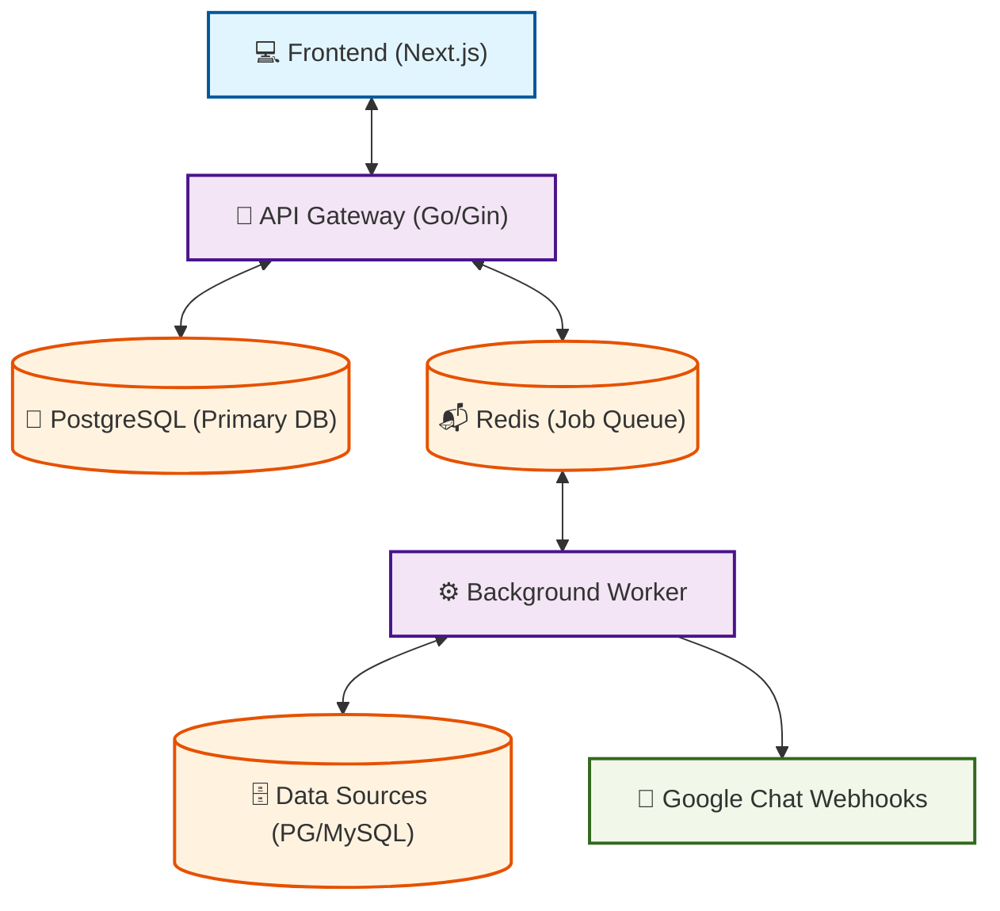

# QueryBase

**Database Explorer & Query Management System with Approval Workflow**

QueryBase is a web-based database exploration platform that allows users to execute SQL queries on PostgreSQL and MySQL databases with an approval workflow for write operations.

## 🚀 Quick Start

### Prerequisites

- **Go** 1.21+ (for backend)
- **Node.js** 18+ and **npm** (for frontend)
- **Docker** and **Docker Compose** (for PostgreSQL and Redis)
- **Make** (optional, for convenient commands)

### 5-Minute Setup

```bash
# 1. Start infrastructure (PostgreSQL, Redis)
make docker-up

# 2. Run database migrations
make migrate-up

# 3. Build and start API server
make build-api
make run-api

# 4. Build and start background worker (new terminal)
make build-worker
make run-worker

# 5. Start frontend (new terminal)
cd web
npm install
npm run dev
```

**Access the application:**

- **Frontend:** http://localhost:3000
- **API:** http://localhost:8080
- **Default Admin:** admin@querybase.local / admin123 ⚠️

## 📋 Architecture Overview



## 🛠️ Technology Stack

### Backend

- **Language:** Go 1.21+
- **Framework:** Gin (HTTP router)
- **ORM:** GORM
- **Database:** PostgreSQL 15 (primary)
- **Cache/Queue:** Redis 7 (Asynq job queue)
- **Auth:** JWT (golang-jwt/jwt)
- **Password Hashing:** bcrypt
- **Config:** Viper (YAML + env vars)

### Frontend

- **Framework:** Next.js 15+ (App Router)
- **Language:** TypeScript
- **Styling:** Tailwind CSS
- **Editor:** Monaco Editor (SQL autocomplete)
- **State Management:** Zustand
- **HTTP Client:** Axios

### DevOps

- **Containerization:** Docker
- **Process Management:** Makefiles
- **Migrations:** Manual SQL migrations
- **Testing:** Go testing + Jest + Playwright (E2E)

## ✨ Key Features

### 🔍 Query Execution

- **SELECT Queries:** Execute immediately with results
- **Write Operations:** CREATE approval workflow
  - INSERT, UPDATE, DELETE, DDL
  - Single-stage approval process
  - Transaction support (start/commit/rollback)
- **Query History:** Track all executed queries
- **Export Results:** CSV and JSON export
- **Row Limiting:** Configurable limits for safety

### 👥 User & Group Management (Plan C)

- **User Roles:** Admin, User, Viewer
- **Groups:** Organize users into functional teams
- **Per-User Group Roles:** Assign specific roles (`viewer`, `member`, `analyst`) to users within each group.
- **Granular RBAC:** Define exact SQL verb permissions (`SELECT`, `INSERT`, `UPDATE`, `DELETE`) per group role for each data source.
- **Permission Merging:** Dynamic resolution of permissions when a user belongs to multiple groups with overlapping access.
- **Three Core Permission Levels:**
  - `can_read`: Execute SELECT queries (governed by role policy)
  - `can_write`: Submit write operation requests (governed by role policy)
  - `can_approve`: Approve/reject write operations

### 📊 Schema Management

- **Schema Browser:** Explore tables, columns, types
- **Polling Updates:** Auto-refresh every 60 seconds
- **Manual Sync:** "Sync Now" button for immediate refresh
- **Background Worker:** Syncs all schemas every 5 minutes
- **Health Tracking:** Monitor data source connectivity

### 🔒 Security

QueryBase implements a hardened security architecture designed for global deployment:

- **Dual-Token Strategy:** Short-lived access tokens (memory) and `HttpOnly/Secure` refresh tokens (cookie).
- **Token Revocation:** Redis-backed blacklisting for immediate session invalidation.
- **Middleware Protection:**
  - **Security Headers:** HSTS, CSP, X-Frame-Options, etc.
  - **Sanitization:** Automatic input validation and cleansing.
- **Intelligent Rate Limiting:** Per-path throttling with prefix matching to prevent UI lag.
- **Encryption:** AES-256 for data source credentials; Bcrypt for passwords.
- **CORS:** Strict origin reflection with credential support.

For detailed information, see **[docs/architecture/security.md](docs/architecture/security.md)**.

### 📝 Approval Workflow

1. User submits write operation query
2. System creates approval request
3. Approvers receive Google Chat notification
4. Approvers review query in dashboard
5. On approval: Background worker executes query
6. Results cached and displayed
7. On rejection: User notified with reason

### 🎨 SQL Editor Features

- **Monaco Editor:** Full-featured code editor
- **Intelligent Autocomplete:**
  - SQL keywords (highest priority)
  - Table names (after FROM/JOIN/INTO/UPDATE)
  - Columns with table prefix (`table.column`)
  - Bare column names (for WHERE clauses)
  - Context-aware suggestions
- **Syntax Highlighting:** SQL syntax highlighting
- **Function Signatures:** COUNT, SUM, AVG, MAX, MIN
- **Real-time Validation:** SQL syntax checking

## 📁 Project Structure

```
querybase/
├── cmd/                          # Application entry points
│   ├── api/main.go              # API server
│   └── worker/main.go           # Background worker
│
├── internal/                    # Private Go code
│   ├── api/                     # API layer
│   │   ├── dto/                 # Data Transfer Objects
│   │   ├── handlers/            # HTTP handlers
│   │   ├── middleware/          # Auth, CORS, logging, RBAC
│   │   └── routes/              # Route definitions
│   ├── auth/                    # Authentication
│   │   ├── jwt.go               # JWT token management
│   │   └── password.go          # Password hashing
│   ├── config/                  # Configuration
│   │   └── config.go            # YAML + env vars
│   ├── database/                # Database connections
│   │   ├── postgres.go          # PostgreSQL
│   │   ├── mysql.go             # MySQL
│   │   └── seeder.go           # Seed data
│   ├── errors/                  # Custom errors
│   ├── models/                  # GORM models
│   │   ├── user.go              # User model
│   │   ├── group.go             # Group model
│   │   ├── datasource.go        # DataSource + Permissions
│   │   ├── query.go             # Query, QueryResult, History
│   │   ├── approval.go          # ApprovalRequest, Review
│   │   └── notification.go      # Notification configs
│   ├── queue/                   # Background jobs
│   │   └── tasks.go             # Asynq task definitions
│   ├── service/                 # Business logic
│   │   ├── query.go             # Query execution
│   │   ├── parser.go            # SQL parsing
│   │   ├── approval.go          # Approval workflow
│   │   ├── datasource.go        # Data source management
│   │   ├── schema.go            # Schema inspection
│   │   └── notification.go      # Google Chat webhooks
│   ├── validation/              # Input validation
│   └── repository/              # Data access layer (TODO)
│
├── migrations/                   # Database migrations
│   ├── postgresql/              # PostgreSQL migrations
│   │   ├── 000001_init_schema.up.sql
│   │   ├── 000001_init_schema.down.sql
│   │   └── ...
│   └── mysql/                   # MySQL data source schemas
│       ├── 001_init_schema.sql
│       └── 002_remove_caching.sql
│
├── tests/                        # Tests (reorganized)
│   ├── unit/                     # Unit tests
│   │   ├── auth_test.go
│   │   ├── models_test.go
│   │   └── ...
│   └── integration/             # Integration tests (TODO)
│
├── web/                         # Next.js frontend
│   ├── src/
│   │   ├── app/                  # Next.js App Router pages
│   │   │   ├── page.tsx          # Home/Dashboard
│   │   │   ├── login/            # Login page
│   │   │   ├── dashboard/        # Query editor
│   │   │   │   ├── page.tsx        # Main dashboard
│   │   │   │   ├── history/        # Query history
│   │   │   │   └── approvals/     # Approval dashboard
│   │   │   └── admin/             # Admin pages
│   │   │       ├── users/          # User management
│   │   │       ├── groups/         # Group management
│   │   │       └── datasources/    # Data source management
│   │   ├── components/           # React components
│   │   │   ├── query/            # Query-related components
│   │   │   ├── admin/            # Admin components
│   │   │   ├── approvals/        # Approval components
│   │   │   └── layout/           # Layout components
│   │   ├── stores/               # Zustand state stores
│   │   │   ├── auth-store.ts
│   │   │   └── schema-store.ts
│   │   ├── lib/                  # Utilities
│   │   │   ├── api-client.ts      # Axios HTTP client
│   │   │   └── utils.ts          # Helper functions
│   │   ├── types/                # TypeScript types
│   │   └── __tests__/            # Frontend unit tests
│   ├── e2e/                      # Playwright E2E tests
│   ├── public/                   # Static assets
│   ├── package.json
│   ├── tailwind.config.ts
│   ├── next.config.ts
│   └── playwright.config.ts
│
├── docker/                       # Docker configurations
│   ├── docker-compose.yml        # Main services
│   └── Dockerfile.*             # Container images
│
├── config/                       # Configuration files
│   └── config.yaml              # Main configuration
│
├── Makefile                      # Convenient commands
├── build.sh                      # Multi-architecture build script
├── go.mod, go.sum                # Go dependencies
├── CLAUDE.md                     # Development guide for Claude Code
└── README.md                     # This file
```

## 🔧 Configuration

### Environment Variables

**Backend (.env or config.yaml):**

```bash
# Server
SERVER_PORT=8080
SERVER_MODE=debug

# Database
DATABASE_HOST=localhost
DATABASE_PORT=5432
DATABASE_USER=querybase
DATABASE_PASSWORD=querybase
DATABASE_NAME=querybase

# Redis
REDIS_HOST=localhost
REDIS_PORT=6379

# JWT
JWT_SECRET=your-secret-key-min-32-chars
JWT_EXPIRE_HOURS=24h

# CORS
CORS_ALLOWED_ORIGINS=http://localhost:3000,http://localhost:3001
CORS_ALLOW_CREDENTIALS=true
```

**Frontend (web/.env.local):**

```bash
NEXT_PUBLIC_API_URL=http://localhost:8080
```

## 📜 Available Commands

### Docker Operations

```bash
make docker-up          # Start PostgreSQL and Redis
make docker-down        # Stop services
make docker-logs        # View logs
make db-shell          # Open PostgreSQL shell
```

### Database

```bash
make migrate-up         # Run migrations
make migrate-down       # Rollback migrations
```

### Build & Run

```bash
# Build
make build              # Build all (native platform)
make build-all          # Build for all platforms
make build-api          # Build API server
make build-worker       # Build worker

# Run
make run-api            # Start API server (http://localhost:8080)
make run-worker         # Start worker (processes background jobs)
```

### Development

```bash
make deps               # Download Go dependencies
make test               # Run tests
make test-coverage      # Run tests with coverage
make fmt                # Format Go code
make lint               # Run linter
make clean              # Clean build artifacts
```

### Multi-Architecture Builds

```bash
./build.sh native       # Build for current platform
./build.sh all         # Build for all platforms (ARM64 + AMD64)
./build.sh linux-amd64  # Build for specific platform
```

## 🔌 API Endpoints

### Authentication

- `POST /api/v1/auth/login` - User login
- `GET /api/v1/auth/me` - Get current user
- `POST /api/v1/auth/change-password` - Change password

### Queries

- `POST /api/v1/queries` - Execute query
- `GET /api/v1/queries` - List queries
- `GET /api/v1/queries/:id` - Get query details
- `DELETE /api/v1/queries/:id` - Delete query
- `GET /api/v1/queries/:id/results` - Get query results (paginated)
- `POST /api/v1/queries/save` - Save query

### Approvals

- `GET /api/v1/approvals` - List approval requests
- `GET /api/v1/approvals/:id` - Get approval details
- `POST /api/v1/approvals/:id/review` - Review (approve/reject)
- `POST /api/v1/transactions/:id/commit` - Commit transaction
- `POST /api/v1/transactions/:id/rollback` - Rollback transaction

### Data Sources

- `GET /api/v1/datasources` - List data sources
- `POST /api/v1/datasources` - Create data source (admin)
- `GET /api/v1/datasources/:id` - Get data source details
- `PUT /api/v1/datasources/:id` - Update data source (admin)
- `DELETE /api/v1/datasources/:id` - Delete data source (admin)
- `POST /api/v1/datasources/:id/test` - Test connection
- `GET /api/v1/datasources/:id/schema` - Get database schema
- `POST /api/v1/datasources/:id/sync` - Force schema sync
- `GET /api/v1/datasources/:id/permissions` - Get permissions
- `PUT /api/v1/datasources/:id/permissions` - Set permissions (admin)

### Users & Groups (Admin)

- `GET /api/v1/auth/users` - List users
- `POST /api/v1/auth/users` - Create user
- `GET /api/v1/auth/users/:id` - Get user details
- `PUT /api/v1/auth/users/:id` - Update user
- `DELETE /api/v1/auth/users/:id` - Delete user
- `GET /api/v1/groups` - List groups
- `POST /api/v1/groups` - Create group
- `GET /api/v1/groups/:id` - Get group details
- `PUT /api/v1/groups/:id` - Update group
- `DELETE /api/v1/groups/:id` - Delete group
- `GET /api/v1/groups/:id/members` - List group members
- `POST /api/v1/groups/:id/members` - Add/Update user role in group
- `DELETE /api/v1/groups/:id/members/:user_id` - Remove user from group
- `GET /api/v1/groups/:id/policies` - List group role policies
- `PUT /api/v1/groups/:id/policies` - Set group role policy
- `GET /api/v1/auth/user/groups` - Get current user's groups and roles

### Health

- `GET /health` - Health check

## 🔐 Default Credentials

⚠️ **IMPORTANT:** Change the admin password after first login!

- **Email:** admin@querybase.local
- **Username:** admin
- **Password:** admin123

## 📖 Documentation

- **[CLAUDE.md](CLAUDE.md)** - Development guide for AI assistants
- **[docs/](docs/)** - Comprehensive documentation
  - Architecture overview
  - Development guides
  - Testing guides
  - Feature documentation

## 🚧 Deployment

### Production Checklist

- [ ] Change `JWT_SECRET` in production
- [ ] Use strong database passwords
- [ ] Enable SSL for database connections
- [ ] Set `SERVER_MODE=release`
- [ ] Configure `CORS_ALLOWED_ORIGINS` for production domain
- [ ] Use environment variables for sensitive data
- [ ] Set up database connection pooling
- [ ] Configure Redis for high availability
- [ ] Set up monitoring and logging
- [ ] Deploy with reverse proxy (nginx/traefik)

### Docker Deployment

```bash
# Build production images
make build-all

# Start services
docker-compose -f docker/docker-compose.yml up -d
```

### Performance Tuning

- **Database:** Connection pooling, read replicas
- **Redis:** Redis Cluster for high availability
- **API:** Multiple instances behind load balancer
- **Worker:** Scale independently based on queue depth

## 🧪 Testing

### Unit Tests

```bash
# Backend
make test
make test-coverage

# Frontend
cd web && npm test
```

### E2E Tests

```bash
cd web
npm run test:e2e
```

## 📝 License

MIT License - See LICENSE file for details

## 🤝 Contributing

Contributions are welcome! Please:

1. Fork the repository
2. Create a feature branch
3. Make your changes
4. Add tests if applicable
5. Submit a pull request

## 📧 Support

For issues, questions, or suggestions, please open an issue on GitHub.

---

**Built with ❤️ using Go, Next.js, and PostgreSQL**
