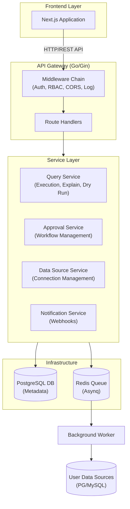

# Architecture Documentation

System design, architecture, and flow documentation for QueryBase.

## Contents

- [Overview](#overview)
- [System Architecture](#system-architecture)
- [Documentation](#documentation)

## Overview

QueryBase is a database explorer system with:

- Multi-database support (PostgreSQL, MySQL)
- Approval workflow for write operations
- Role-based access control (RBAC)
- Query execution with result caching
- Real-time notifications

## System Architecture



## Documentation

### 1. [Flow Diagrams](flow.md)

**Visual System Flow**

ASCII art diagrams showing:

- Main query execution flow
- SELECT query path
- Write query approval workflow
- EXPLAIN and dry run flows
- Database interactions
- Decision trees

**When to Read:**

- Understanding system behavior
- Debugging flow issues
- Learning query execution lifecycle
- Onboarding new developers

### 2. [Detailed Flow](detailed-flow.md)

**Technical Implementation Details**

Comprehensive technical documentation:

- Step-by-step execution flow
- Authentication & authorization phases
- Service layer interactions
- Database operations
- Security layers
- Performance considerations
- Error handling
- Monitoring & observability

### 3. [Frontend Schema Technical](frontend-schema-technical.md)

**Technical Implementation Summary**

Detailed documentation on:

- Frontend state management (Zustand)
- WebSocket integration for schema updates
- Monaco Editor SQL autocomplete provider
- Dashboard data fetching and robustness fixes

**When to Read:**

- Deep diving into frontend technical implementation
- Improving autocomplete or real-time feature
- Debugging dashboard data issues

## Key Architectural Decisions

### 1. Separation of Concerns

- **API Layer**: HTTP handling, routing, middleware
- **Service Layer**: Business logic, validation
- **Data Layer**: Database operations, caching

### 2. Approval Workflow

- Write operations require approval before execution
- Transaction-based preview (preview before commit)
- Asynchronous execution via Redis queue
- Complete audit trail

### 3. Security Layers

- JWT-based authentication
- Role-based access control (RBAC)
- Group-based permissions
- Encrypted data source credentials (AES-256-GCM)
- SQL injection prevention

### 4. Multi-Database Support

- Primary database: PostgreSQL (QueryBase metadata)
- Target databases: PostgreSQL, MySQL (user data)
- Connection pooling per data source
- Encrypted password storage

### 5. Scalability

- Stateless API servers (can run multiple instances)
- Background workers (can scale independently)
- Redis queue for async processing
- Result caching for performance

## Data Flow

### SELECT Query (Direct Execution)

```
User → API → Parser → Check Permissions → Execute → Cache → Return
Time: 80-600ms
```

### Write Query (Approval Workflow)

```
User → API → Parser → Create Approval → Notify Approvers → Wait
                                                        ↓
                                           Approve → Queue → Worker → Execute
Time: Minutes to days (human approval)
Execution: 100-700ms
```

## Technology Stack

### Backend

- **Language**: Go 1.22+
- **Framework**: Gin (HTTP router)
- **ORM**: GORM
- **Authentication**: JWT (golang-jwt/jwt)
- **Queue**: Asynq (Redis-based)
- **Password Hashing**: bcrypt

### Databases

- **Primary**: PostgreSQL 15
- **Queue**: Redis 7
- **Data Sources**: PostgreSQL, MySQL

### Frontend

- **Framework**: Next.js 15+ (App Router)
- **Language**: TypeScript
- **State Management**: Zustand
- **Styling**: Tailwind CSS
- **Editor**: Monaco (SQL editor)

## Security Architecture

```
1. Transport Layer
   └─> HTTPS/TLS (production)

2. Authentication
   └─> JWT tokens (HS256)

3. Authorization
   └─> RBAC with user_permissions view

4. Data Encryption
   └─> AES-256-GCM for passwords

5. SQL Injection Prevention
   └─> Prepared statements, validation

6. Audit Trail
   └─> Complete history logging
```

## Performance Considerations

### Optimization Strategies

1. **Connection Pooling**: Per data source
2. **Result Caching**: JSONB storage
3. **Async Processing**: Redis queue for writes
4. **Streaming**: Large result sets
5. **Pagination**: Limit response sizes

### Monitoring Points

- Query execution time
- Queue depth
- Worker utilization
- Data source health
- Error rates

## Related Documentation

- **[Getting Started](../getting-started/)** - Setup and installation
- **[User Guide](../user-guide/)** - How to use features
- **[Development](../development/)** - Testing and building
- **[CLAUDE.md](../../CLAUDE.md)** - Complete project guide

---

**Last Updated:** January 27, 2025
