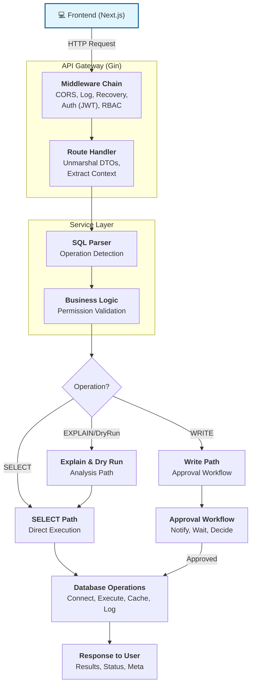

# QueryBase Query Execution Flow

Complete flow from user submission to query execution, including authentication, authorization, operation detection, and the approval workflow.

---

## High-Level Architecture



---

## Detailed Step-by-Step Flow

### Phase 1: Authentication & Authorization

```
1. User submits request with JWT token
   ├─→ Header: Authorization: Bearer <token>
   └─→ Token contains: user_id, email, role

2. Auth Middleware validates JWT
   ├─→ Parse and validate token signature
   ├─→ Extract user claims (user_id, role)
   ├─→ Check token expiration
   └─→ Set user_id in Gin context

3. RBAC Middleware checks permissions (if required)
   ├─→ Check user role (admin/user/viewer)
   ├─→ Verify user has required permission
   └─→ Return 403 Forbidden if unauthorized
```

**Middleware Chain:**

```go
router.Use(middleware.AuthMiddleware(jwtManager))
   ↓
router.Use(middleware.RequireAdmin())  // For admin-only routes
```

---

### Phase 2: Query Submission

```
4. User submits query via API
   POST /api/v1/queries
   Headers:
     - Authorization: Bearer <JWT_TOKEN>
     - Content-Type: application/json

   Body:
   {
     "data_source_id": "uuid-of-data-source",
     "query_text": "SELECT * FROM users WHERE status = 'active'",
     "name": "Active Users Query",
     "description": "Get all active users"
   }

5. Request Handler processes request
   ├─→ Unmarshal JSON to DTO
   ├─→ Validate required fields
   ├─→ Extract user_id from context
   └─→ Call QueryService.ExecuteQuery()
```

---

### Phase 3: Operation Detection

```go
6. SQL Parser analyzes query
   DetectOperationType(queryText)
   ├─→ Sanitize SQL (remove comments)
   ├─→ Trim whitespace
   ├─→ Convert to uppercase
   ├─→ Match against patterns:
   │   ├─→ SELECT → OperationSelect
   │   ├─→ INSERT → OperationInsert
   │   ├─→ UPDATE → OperationUpdate
   │   ├─→ DELETE → OperationDelete
   │   ├─→ CREATE TABLE → OperationCreateTable
   │   ├─→ DROP TABLE → OperationDropTable
   │   ├─→ ALTER TABLE → OperationAlterTable
   │   └─→ Other → OperationUpdate (default)
   └─→ Return operation type

7. Check if operation requires approval
   RequiresApproval(operationType)
   ├─→ SELECT → false (execute immediately)
   └─→ INSERT/UPDATE/DELETE/DDL → true (needs approval)
```

---

### Phase 4A: SELECT Query Path (Direct Execution)

```
8A. For SELECT queries only:

    8A.1 Validate data source exists
         └─→ Query database for data_source_id

    8A.2 Check user permissions
         └─→ Query user_permissions view
             - User must have can_read permission
             - OR user must be admin

    8A.3 Connect to data source
         ├─→ Decrypt password using AES-256-GCM
         ├─→ Build DSN (Data Source Name)
         └─→ Establish connection
             - PostgreSQL: postgres.Open(dsn)
             - MySQL: mysql.Open(dsn)

    8A.4 Execute query
         └─→ db.Raw(queryText).Rows()
             - Returns database cursor
             - Streams results row by row

    8A.5 Parse results
         ├─→ Get column names
         ├─→ Scan each row into map[string]interface{}
         └─→ Convert byte[] to string

    8A.6 Cache results
         ├─→ Serialize results to JSON
         ├─→ Create QueryResult record:
         │   {
         │     query_id: uuid,
         │     row_count: 100,
         │     column_names: ["id", "name", ...],
         │     column_types: ["int", "varchar", ...],
         │     data: [{...}, {...}, ...],
         │     stored_at: timestamp
         │   }
         └─→ Save to PostgreSQL query_results table

    8A.7 Update query status
         └─→ UPDATE queries SET status = 'completed'

    8A.8 Log to history
         └─→ INSERT INTO query_history:
             {
               query_id: uuid,
               user_id: uuid,
               data_source_id: uuid,
               query_text: "...",
               operation_type: "select",
               status: "completed",
               row_count: 100,
               executed_at: timestamp
             }

    8A.9 Return results to user
         └─→ JSON Response:
             {
               "query_id": "uuid",
               "status": "completed",
               "row_count": 100,
               "data": [...],
               "columns": [...],
               "executed_at": "2025-01-27T..."
             }
```

---

### Phase 4B: Write Query Path (Approval Workflow)

```
8B. For INSERT/UPDATE/DELETE/DDL queries:

    8B.1 Validate data source exists
         └─→ Query database for data_source_id

    8B.2 Check user permissions
         └─→ Query user_permissions view
             - User must have can_write permission
             - OR user must be admin

    8B.3 Validate SQL syntax
         ├─→ Check if query is empty
         ├─→ Check for balanced parentheses
         ├─→ Check for unterminated strings
         ├─→ Check for required keywords (VALUES, SET, FROM)
         └─→ Return error if invalid

    8B.4 Create approval request
         └─→ INSERT INTO approval_requests:
             {
               id: uuid,
               query_text: "DELETE FROM users WHERE id = 1",
               operation_type: "delete",
               data_source_id: uuid,
               requested_by: uuid,
               status: "pending",
               created_at: timestamp
             }

    8B.5 Fetch eligible approvers
         ├─→ Query user_permissions view
         ├─→ Filter users with can_approve = true
         └─→ Get list of approvers for data source

    8B.6 Send notifications
         └─→ For each approver:
             INSERT INTO notifications:
             {
               approver_id: uuid,
               approval_request_id: uuid,
               status: "pending",
               sent_at: timestamp
             }

             └─→ Send Google Chat webhook:
                 POST <webhook_url>
                 {
                   "text": "New approval request for DELETE query...",
                   "cards": [...]
                 }

    8B.7 Return approval request to user
         └─→ JSON Response:
             {
               "approval_id": "uuid",
               "status": "pending",
               "requires_approval": true,
               "message": "Query submitted for approval"
             }
```

---

### Phase 5: Approval Review

```
9. Approver reviews request
    POST /api/v1/approvals/:id/review

    Body:
    {
      "decision": "approved",  // or "rejected"
      "comments": "Looks good to delete"
    }

10. Create approval review
    └─→ INSERT INTO approval_reviews:
        {
          id: uuid,
          approval_request_id: uuid,
          reviewer_id: uuid,
          decision: "approved",
          comments: "...",
          reviewed_at: timestamp
        }

11. Update approval status
    └─→ UPDATE approval_requests
        SET status = 'approved'
        WHERE id = uuid

12. Send notification to requester
    └─→ Notify original user:
        - Your query was approved
        - Ready to execute (or rejected with reason)
```

---

### Phase 6: Query Execution (After Approval)

```
13. Background worker picks up approved request
    └─→ Redis Queue (Asynq)
        - Task: ExecuteApprovedQuery
        - Payload: {approval_id: uuid}

14. Start transaction for preview (optional)
    POST /api/v1/approvals/:id/transaction-start

    14.1 Begin database transaction
        └─→ tx.Begin()

    14.2 Execute query in transaction
        └─→ tx.Raw(queryText).Rows()

    14.3 Return preview results
        └─→ Show affected rows without committing

    14.4 Keep transaction open
        └─→ Store in activeTransactions map
            - Key: data_source_id
            - Value: {db, started_at, last_activity_at}

15. Approver reviews preview
    ├─→ Option A: Commit
    │   POST /api/v1/transactions/:id/commit
    │   └─→ tx.Commit()
    │
    └─→ Option B: Rollback
        POST /api/v1/transactions/:id/rollback
        └─→ tx.Rollback()

16. If committed, finalize execution
    16.1 Create query result record
        └─→ INSERT INTO query_results:
            {
              query_id: uuid,
              row_count: affected_rows,
              column_names: [...],
              data: [...],
              stored_at: timestamp
            }

    16.2 Update approval request
        └─→ UPDATE approval_requests
            SET status = 'executed',
                executed_at = timestamp
            WHERE id = uuid

    16.3 Log to query history
        └─→ INSERT INTO query_history:
            {
              query_id: uuid,
              user_id: uuid,
              data_source_id: uuid,
              query_text: "...",
              operation_type: "delete",
              status: "completed",
              row_count: 5,
              executed_at: timestamp
            }

    16.4 Send final notification
        └─→ Notify requester:
            - Query executed successfully
            - Affected rows: 5
            - Execution time: 123ms
```

---

## Special Features

### Feature 1: EXPLAIN Query

```
POST /api/v1/queries/explain

Flow:
1. User submits query with analyze flag
2. Validate data source and permissions
3. Build EXPLAIN query:
   - EXPLAIN SELECT ...
   - or EXPLAIN ANALYZE SELECT ... (if analyze = true)
4. Execute EXPLAIN on data source
5. Parse execution plan:
   - Index usage
   - Join strategies
   - Cost estimates
   - Row counts
6. Return structured plan:
   {
     "plan": [...],
     "raw_output": "..."
   }

Use Cases:
- Optimize slow queries
- Check index usage
- Verify join order
- Estimate query cost
```

### Feature 2: Dry Run DELETE

```
POST /api/v1/queries/dry-run

Flow:
1. User submits DELETE query
2. Validate it's a DELETE operation
3. Convert DELETE to SELECT:
   DELETE FROM users WHERE id = 1
   → SELECT * FROM users WHERE id = 1
4. Execute SELECT query
5. Return affected rows:
   {
     "affected_rows": 1,
     "query": "SELECT * FROM users WHERE id = 1",
     "rows": [{id: 1, name: "Alice", ...}]
   }

Use Cases:
- Preview affected rows before deletion
- Verify WHERE clause correctness
- Count affected rows
- Review data to be deleted
```

---

## Additional Features (Backend Polish)

### Feature 3: Query Results Pagination ✨ NEW

```
GET /api/v1/queries/:id/results?page=1&per_page=100&sort_column=id&sort_direction=asc

Flow:
1. User requests paginated results for a query
2. Validate query ownership (admin or query owner)
3. Fetch QueryResult from database
4. Parse JSONB data into memory
5. Sort results if sort_column specified
   - Numeric sort for int/float columns
   - String sort for text columns
   - Nil values sorted first
6. Paginate with offset/limit
7. Return paginated response:
   {
     "query_id": "uuid",
     "row_count": 100,
     "columns": [...],
     "data": [...],  // Subset of rows
     "metadata": {
       "page": 1,
       "per_page": 100,
       "total_pages": 10,
       "total_rows": 1000,
       "has_next": true,
       "has_prev": false
     },
     "sort_column": "id",
     "sort_direction": "asc"
   }

Benefits:
- Faster response times for large result sets
- Reduced bandwidth usage
- Better UI performance
- Configurable page size (10-1000 rows)

Implementation:
- Server-side sorting with bubble sort algorithm
- Client-side friendly metadata (has_next, has_prev)
- Column-aware sorting (numeric vs string)
- Nil-safe sorting (nil values first)
```

### Feature 4: Query Export API ✨ NEW

```
POST /api/v1/queries/export

Body:
{
  "query_id": "uuid",
  "format": "csv"  // or "json"
}

Flow:
1. User requests export in specific format
2. Validate query ownership
3. Fetch QueryResult from database
4. Parse JSONB data
5. Export based on format:

   CSV Format:
   - Proper RFC 4180 formatting
   - Headers: column names
   - Rows: data values
   - Special character escaping:
     - Quotes doubled: " → ""
     - Values wrapped in quotes
     - Nil values as empty strings
   - Content-Type: text/csv
   - Content-Disposition: attachment; filename="query_uuid.csv"

   JSON Format:
   - Structured output with metadata
   - Includes columns, row_count, data array
   - Pretty-printed (2-space indent)
   - Content-Type: application/json
   - Content-Disposition: attachment; filename="query_uuid.json"

Example CSV Output:
"id","name","email"
"1","Alice","alice@example.com"
"2","Bob","bob@example.com"

Example JSON Output:
{
  "columns": ["id", "name", "email"],
  "row_count": 2,
  "data": [
    {"id": 1, "name": "Alice", "email": "alice@example.com"},
    {"id": 2, "name": "Bob", "email": "bob@example.com"}
  ]
}

Use Cases:
- Data export for analysis in Excel/Google Sheets
- Backup of query results
- Share results with non-technical users
- Integration with external tools
```

### Feature 5: Approval Comments System ✨ NEW

```
POST /api/v1/approvals/:id/comments
GET  /api/v1/approvals/:id/comments
DELETE /api/v1/approvals/:id/comments/:comment_id

Body (Create):
{
  "comment": "Please review this carefully before approving"
}

Response (List):
{
  "comments": [
    {
      "id": "uuid",
      "approval_request_id": "uuid",
      "user_id": "uuid",
      "username": "jdoe",
      "full_name": "John Doe",
      "comment": "Please review this...",
      "created_at": "2025-01-28T12:00:00Z",
      "updated_at": "2025-01-28T12:00:00Z"
    }
  ],
  "total": 5,
  "page": 1,
  "per_page": 50
}

Flow:
1. User adds comment to approval request
2. System validates approval exists
3. Create approval_comment record:
   - approval_request_id: UUID
   - user_id: UUID (commenter)
   - comment: Text (1-5000 chars)
   - created_at, updated_at: timestamps
4. Preload user data for response
5. Pagination support (default 50 per page)
6. Delete permissions:
   - Comment author can delete
   - Admin can delete any comment
7. Comments ordered chronologically (oldest first)

Use Cases:
- Collaboration between approvers
- Clarification on query intent
- Risk assessment discussion
- Audit trail of approval decisions
- Context for future reference

Database Schema:
- Table: approval_comments
- Indexes: approval_request_id, user_id, created_at
- Foreign Keys: approval_requests(id), users(id)
- Cascading Deletes: approval_requests → comments
```

### Feature 6: Data Source Health Check API ✨ NEW

```
GET /api/v1/datasources/:id/health

Response:
{
  "data_source_id": "uuid",
  "status": "healthy",  // "healthy" | "degraded" | "unhealthy"
  "latency_ms": 45,
  "last_error": "",
  "last_checked": "2025-01-28T12:00:00Z",
  "message": "Data source is healthy"
}

Flow:
1. User requests health check for data source
2. Validate user has read permission
3. Check if data source is active
4. Decrypt password (AES-256-GCM)
5. Measure connection latency:
   - Start timer
   - Attempt connection (Ping only)
   - Stop timer
6. Determine health status:
   - Connection failed → "unhealthy"
   - Latency < 1000ms → "healthy"
   - Latency >= 1000ms → "degraded"
7. Return health response

Health Status Criteria:
- healthy: Connection successful, latency < 1 second
- degraded: Connection successful, latency >= 1 second
- unhealthy: Connection failed or data source inactive

Use Cases:
- Monitor data source availability
- Alert on connection issues
- Performance monitoring (latency tracking)
- Pre-flight checks before query execution
- Dashboard health indicators

Implementation:
- Test connection via Ping() (no query execution)
- Latency measured in milliseconds
- Last checked timestamp for freshness
- Detailed error messages for debugging
```

### Feature 7: Error Handling Improvements ✨ NEW

```
Custom Error Types:
- AppError struct with HTTP status code
- Standardized error responses
- Context-aware error messages
- Error wrapping for root cause analysis

Error Response Format:
{
  "error": "User-friendly message",
  "details": "Technical details (optional)",
  "code": 400  // HTTP status code
}

Common Error Types:
- BadRequest (400): Invalid input, validation failed
- Unauthorized (401): Invalid/expired token
- Forbidden (403): Insufficient permissions
- NotFound (404): Resource not found
- Conflict (409): Duplicate resource, state conflict
- InternalError (500): Server error
- ServiceUnavailable (503): Service down

Helper Functions:
- SendError(c, err) - Send AppError as JSON
- SendBadRequest(c, message) - Send 400 error
- SendUnauthorized(c, message) - Send 401 error
- SendForbidden(c, message) - Send 403 error
- SendNotFound(c, message) - Send 404 error
- SendInternalError(c, message) - Send 500 error

Validation Helpers:
- ValidateUUID(id) - Check UUID format
- ValidateEmail(email) - Check email format
- ValidateUsername(username) - 3-30 chars, alphanumeric
- ValidatePassword(password) - Min 8 chars
- ValidateRequired(field, value) - Not empty check
- ValidateMaxLength(field, value, max) - Max length check
- ValidatePort(port) - 1-65535 range
- ValidateSQL(sql) - Basic SQL safety checks

Middleware:
- ErrorRecoveryMiddleware: Catch panics, return 500
- LoggingMiddleware: Log all requests with context
  - Timestamp, method, path, user_id, status
  - Duration (for performance monitoring)
  - Client IP (for security)
  - Slow request alerts (> 1 second)
  - Error logging with stack traces
```

---

## Database Interactions

### QueryBase PostgreSQL Database

```sql
-- Authentication
users                   → User accounts, passwords (hashed), roles
groups                  → Groups for RBAC
user_groups             → User-group memberships
data_source_permissions → Group permissions per data source

-- Data Sources
data_sources            → Database connections (passwords encrypted)
                        → Encrypted with AES-256-GCM
                        → Supports PostgreSQL and MySQL

-- Queries
queries                 → Saved queries with metadata
query_results           → Cached query results (JSONB)
query_history           → Execution history log

-- Approvals
approval_requests       → Write operation approval requests
approval_reviews        → Approval decisions
notifications           → Notification queue for approvers
```

### Target Data Sources (PostgreSQL/MySQL)

```sql
-- User's actual databases where queries run
-- QueryBase connects as a regular user
-- Executes queries via connection string:
-- PostgreSQL: "host=localhost port=5432 user=xxx password=xxx dbname=xxx"
-- MySQL: "user:password@tcp(host:port)/dbname"
```

---

## Security Layers

```
1. Transport Layer Security
   └─→ HTTPS/TLS (production requirement)

2. Authentication
   └─→ JWT tokens
       - Signed with HS256
       - Contains: user_id, email, role, exp, iat
       - Validated on every request

3. Authorization (RBAC)
   └─→ Three levels:
       ├─→ Superuser: admin role (bypasses all checks)
       ├─→ Group-based: user_permissions view
       └─→ Permission types:
           ├─→ can_read: Execute SELECT queries
           ├─→ can_write: Submit write operation requests
           └─→ can_approve: Approve/reject write operations

4. Data Encryption
   └─→ Data source passwords encrypted
       - Algorithm: AES-256-GCM
       - Key: From config file
       - Nonce: 12 bytes (random per encryption)
       - Stored as base64(nonce + ciphertext)

5. SQL Injection Prevention
   └─→ Parameter validation
       - SQL syntax validation
       - Comment removal
       - String literal validation
       - Prepared statements (via GORM)

6. Audit Trail
   └─→ Complete history
       - query_history: All query executions
       - approval_requests: All write operations
       - approval_reviews: All approval decisions
       - notifications: All notifications sent
```

---

## Error Handling

```
Error Scenarios:

1. Authentication Errors
   ├─→ Invalid token → 401 Unauthorized
   ├─→ Expired token → 401 Unauthorized
   └─→ Missing token → 401 Unauthorized

2. Authorization Errors
   ├─→ Insufficient permissions → 403 Forbidden
   ├─→ Data source not accessible → 403 Forbidden
   └─→ Not an admin → 403 Forbidden

3. Validation Errors
   ├─→ Invalid JSON → 400 Bad Request
   ├─→ Missing required fields → 400 Bad Request
   ├─→ Empty query → 400 Bad Request
   ├─→ Invalid SQL syntax → 400 Bad Request
   └─→ Unbalanced parentheses → 400 Bad Request

4. Data Source Errors
   ├─→ Data source not found → 404 Not Found
   ├─→ Connection failed → 500 Internal Server Error
   ├─→ Invalid credentials → 500 Internal Server Error
   └─→ Database unreachable → 500 Internal Server Error

5. Execution Errors
   ├─→ SQL execution failed → 500 Internal Server Error
   ├─→ Table doesn't exist → 500 Internal Server Error
   ├─→ Permission denied on data source → 403 Forbidden
   └─→ Query timeout → 500 Internal Server Error

6. Approval Workflow Errors
   ├─→ Already approved → 400 Bad Request
   ├─→ Already rejected → 400 Bad Request
   ├─→ Not pending → 400 Bad Request
   └─→ Duplicate review → 400 Bad Request
```

---

## Performance Considerations

```
QueryBase Optimization:
1. Connection Pooling
   └─→ GORM manages connection pool per data source

2. Result Caching
   └─→ Query results stored in query_results table (JSONB)
       - Enables faster retrieval
       - Can be expired/refreshed
       - Stores execution metadata

3. Streaming Results
   └─→ Large result sets streamed row by row
       - Avoids loading entire result in memory
       - Better for large queries

4. Async Processing
   └─→ Write operations executed via Redis queue
       - Asynq task queue
       - Background workers
       - Non-blocking for API

5. Pagination
   └─→ Query history and list queries paginated
       - LIMIT/OFFSET or cursor-based
       - Reduces response size
       - Faster UI loading

Database Optimization:
1. Indexes on frequently queried columns
2. JSONB for flexible result storage
3. Materialized view for user_permissions
4. Connection pooling for data sources
```

---

## Monitoring & Observability

```
Logging (✅ Implemented):
- Request logging middleware → internal/api/middleware/logging.go
  - Logs timestamp, method, path, user_id, status, duration, client_ip
  - Logs errors with full context
  - Logs slow requests (> 1 second)
  - Format: [timestamp] method path user_id status duration client_ip
- Error recovery middleware → internal/api/middleware/logging.go
  - Recovers from panics gracefully
  - Returns 500 Internal Server Error on panic
  - Logs panic details for debugging
- Error tracking → internal/errors/errors.go
  - Custom AppError types with HTTP status codes
  - Standardized error responses
  - Context-aware error messages
- Audit trail
  - query_history: All query executions
  - approval_requests: All write operations
  - approval_reviews: All approval decisions
  - approval_comments: All discussion threads

Metrics (TODO):
- Query execution time
- Queue depth
- Worker pool utilization
- Data source health checks

Alerts (TODO):
- Failed data source connections
- Long-running queries
- Queue backlog
- High error rates
```

---

## Summary

The complete QueryBase flow involves:

1. **User Authentication** → JWT validation
2. **Permission Check** → RBAC via user_permissions
3. **Operation Detection** → SQL parser identifies operation type
4. **Route Selection**:
   - SELECT → Direct execution
   - Write operations → Approval workflow
5. **SELECT Path**:
   - Connect to data source
   - Execute query
   - Cache results
   - Log history
   - Return results
6. **Write Path**:
   - Create approval request
   - Notify approvers
   - Wait for approval
   - Execute via background worker
   - Log history
   - Notify completion
7. **Special Features**:
   - EXPLAIN for performance analysis
   - Dry run for safe DELETE preview

**Core Features (Original):**

- ✅ Secure authentication and authorization
- ✅ SQL injection prevention
- ✅ Approval workflow for write operations
- ✅ Query result caching
- ✅ Complete audit trail
- ✅ Multi-database support (PostgreSQL, MySQL)
- ✅ EXPLAIN for query optimization
- ✅ Dry run for safe DELETE operations

**New Features (Backend Polish - 2025-01-28):**

- ✅ Query results pagination with sorting
- ✅ Query export (CSV/JSON formats)
- ✅ Approval comments system for collaboration
- ✅ Data source health check API
- ✅ Improved error handling with custom error types
- ✅ Request logging middleware with slow request tracking
- ✅ Panic recovery middleware
- ✅ Input validation helpers
- ✅ Standardized API response helpers

**UI Improvements (2026-02-16):**

- ✅ Session stability improvements with intelligent 401 handling
- ✅ Toast notification system (react-hot-toast)
- ✅ Replaced all alert() calls with persistent toast notifications
- ✅ Non-blocking user feedback for all operations
- ✅ Consistent design system integration

**Integration Testing:**

- ✅ Comprehensive integration test script (scripts/integration-test.sh)
- Tests all flows from authentication to query execution
- Tests approval workflow with comments
- Tests transaction preview/commit/rollback
- Tests export functionality
- Tests health check API
- Tests permission system

**Total API Endpoints: 41** (including 7 new endpoints)

- Authentication: 3 endpoints
- User Management: 6 endpoints
- Group Management: 7 endpoints
- Queries: 10 endpoints (including pagination, export, history, explain, dry-run)
- Approvals: 7 endpoints (including comments, transaction operations)
- Transactions: 3 endpoints
- Data Sources: 5 endpoints (including health check)
