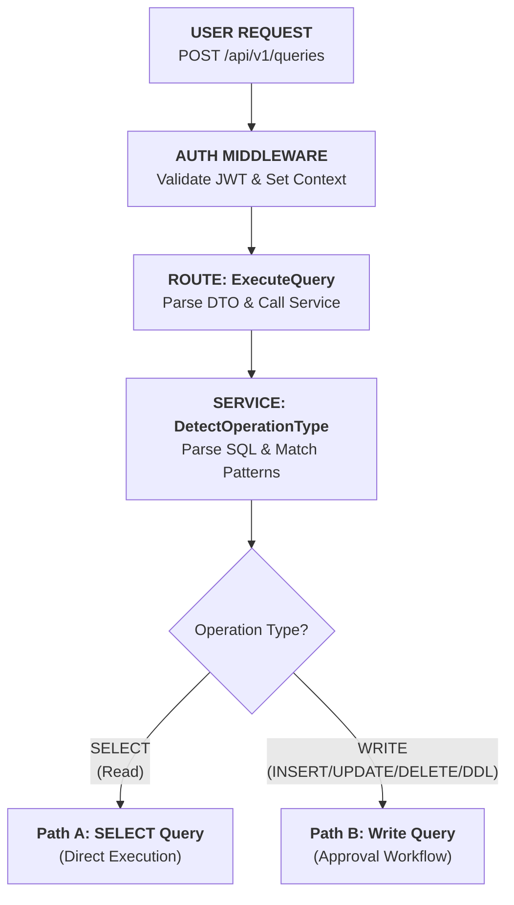
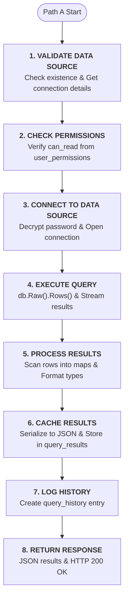
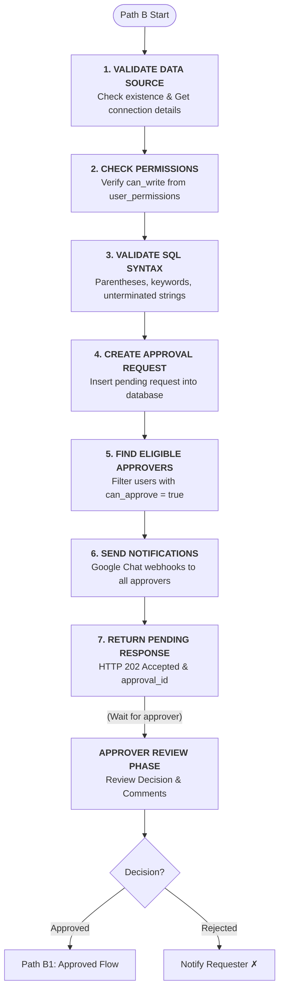
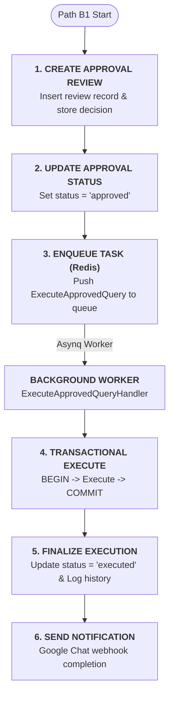
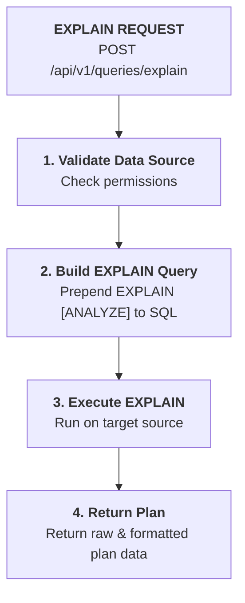
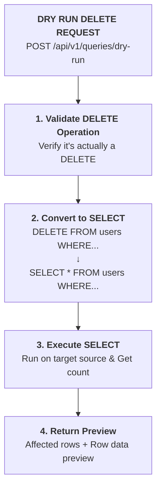
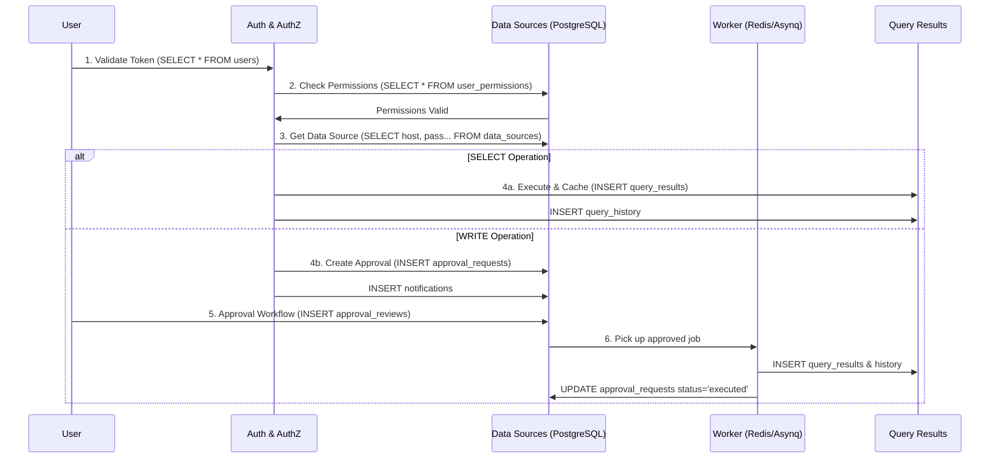
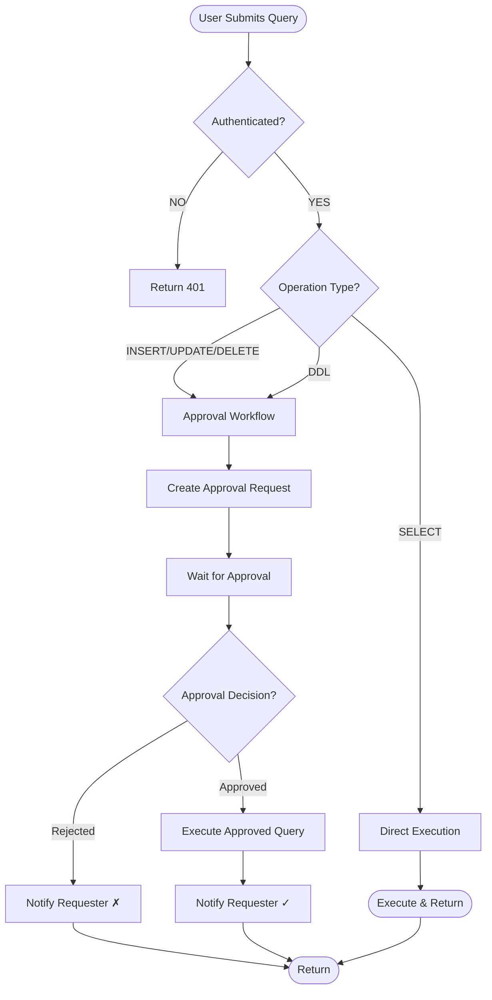

# QueryBase Visual Flow Diagram

Quick visual reference for QueryBase query execution flow.

---

## Main Flow: User to Query Execution

---

## Path A: SELECT Query (Direct Execution)

**Total Time:** ~100-500ms (depending on query)

---

## Path B: Write Query (Approval Workflow)

---

## Path B1: Approved Query Execution

**Total Time:** 2-5 minutes (human wait) + 100-500ms (exec)

---

## Special Features Flow

### EXPLAIN Query Flow

### Dry Run DELETE Flow

---

## Database Flow Summary (Sequence)

---

## Quick Decision Tree

---

## Time Estimates

| Operation          | Phase             | Time Estimate |
| :----------------- | :---------------- | :------------ |
| **SELECT**         | Total Lifecycle   | 80-600ms      |
| **Write (Submit)** | Submission only   | 80-165ms      |
| **Write (Wait)**   | Human approval    | 2m - 7 days   |
| **Write (Exec)**   | Worker processing | 100-700ms     |

---

## Key Takeaways

1. **SELECT queries** execute immediately (80-600ms)
2. **Write queries** go through approval workflow (minutes to days)
3. **Authentication** via JWT on every request
4. **Authorization** via user_permissions view (RBAC)
5. **All queries** logged to query_history
6. **SELECT results** cached in query_results table
7. **Write operations** tracked via approval_requests
8. **Notifications** sent via Google Chat webhooks
9. **Background workers** execute approved write queries
10. **Audit trail** complete and queryable
